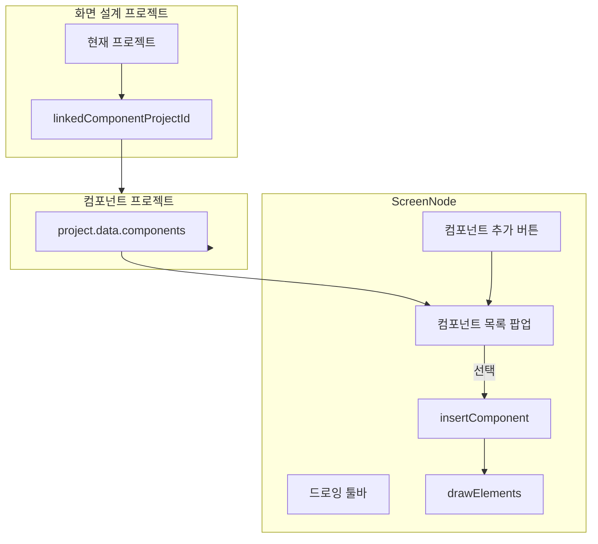

# 화면 설계 캔버스에 컴포넌트 삽입 기능 추가

## 개요

화면 설계 프로젝트에서 연결된 컴포넌트 프로젝트의 컴포넌트를 드로잉 툴바를 통해 선택하여 현재 화면 캔버스에 삽입할 수 있도록 구현합니다.

## 사전 조건

- 화면 설계 프로젝트가 **컴포넌트 프로젝트와 연결**되어 있어야 함 (`linkedComponentProjectId`)
- 프로젝트 목록에서 "컴포넌트 연결" 버튼으로 연결 가능 (이미 구현됨)

## 구현 계획

### 1. 컴포넌트 목록 데이터 소스

[ScreenNode.tsx](src/components/ScreenNode.tsx)에서 `useProjectStore`로 접근:

```ts
const linkedComponentProject = projects.find(p => p.id === currentProject?.linkedComponentProjectId);
const componentList = (linkedComponentProject?.data as any)?.components ?? [];
```

- `linkedComponentProjectId`가 없으면 컴포넌트 추가 버튼 숨김 또는 비활성화
- 원격 프로젝트의 경우 `componentSnapshot` 등 데이터 구조 확인 필요

### 2. 드로잉 툴바에 "컴포넌트 추가" 버튼 추가

[ScreenNode.tsx](src/components/ScreenNode.tsx) 드로잉 툴바 영역 (표 삽입 버튼 근처, ~1742행):

- **표시 조건**: `!screen.screenId?.startsWith('CMP-')` (화면 설계일 때만)
- **버튼**: Box 아이콘 + "컴포넌트 추가" (표 삽입과 유사한 스타일)
- 클릭 시 컴포넌트 목록 팝업 토글 (표 삽입과 동일한 패턴)

### 3. 컴포넌트 목록 팝업 UI

표 삽입 팝업(`data-table-picker-portal`)과 유사한 구조:

- `showComponentPicker` 상태로 열기/닫기
- `componentPickerPos`로 팝업 위치 (버튼 아래)
- `createPortal`로 `panel-portal-root`에 렌더링
- 목록: `componentList.map(c => ...)` — 이름, screenId, 썸네일(있으면) 표시
- 연결된 프로젝트 없음: "컴포넌트 프로젝트를 연결해 주세요" 메시지
- 목록 비어 있음: "컴포넌트가 없습니다" 메시지

### 4. 컴포넌트 삽입 로직

선택한 컴포넌트의 `drawElements`를 현재 화면에 복사:

```ts
const insertComponent = (component: Screen) => {
  const elements = component.drawElements ?? [];
  if (elements.length === 0) return; // 또는 placeholder 처리

  const cw = canvasRef.current?.clientWidth ?? 0;
  const ch = canvasRef.current?.clientHeight ?? 0;
  const offsetX = cw / 2 - (component.imageWidth ?? 400) / 2;
  const offsetY = ch / 2 - (component.imageHeight ?? 300) / 2;

  const idMap = new Map<string, string>();
  const newElements: DrawElement[] = elements.map((el, i) => {
    const newId = `draw_${Date.now()}_${i}`;
    idMap.set(el.id, newId);
    return {
      ...el,
      id: newId,
      x: el.x + offsetX,
      y: el.y + offsetY,
      // groupId, 참조 등 필요 시 idMap으로 갱신
    };
  });

  const nextElements = [...drawElements, ...newElements];
  update({ drawElements: nextElements });
  syncUpdate({ drawElements: nextElements });
  setShowComponentPicker(false);
};
```

- 각 요소 ID를 `draw_${timestamp}_${index}` 형태로 새로 부여
- 좌표는 캔버스 중앙 기준으로 오프셋 적용
- `update` + `syncUpdate`로 협업 동기화

### 5. 수정 파일


| 파일                                              | 변경 내용                                                                                                         |
| ----------------------------------------------- | ------------------------------------------------------------------------------------------------------------- |
| [ScreenNode.tsx](src/components/ScreenNode.tsx) | `linkedComponentProject`, `componentList` 추가, `showComponentPicker` 상태, 컴포넌트 추가 버튼 및 팝업, `insertComponent` 함수 |


### 6. 데이터 흐름




## 주의사항

- 컴포넌트 내부 `drawElements`에 `groupId`가 있으면, 복사 시 새 ID로 매핑 필요
- 이미지 요소(`imageUrl`)는 URL 그대로 복사 (동일 프로젝트/저장소 사용 가정)
- `contentMode: 'IMAGE'`인 컴포넌트는 `drawElements`가 비어 있을 수 있음 — 이 경우 이미지 요소 1개로 변환하거나 "내용 없음" 처리 가능

